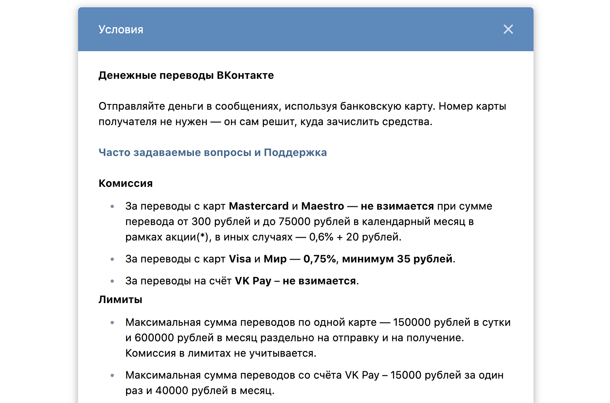

Выполнила Прыгара О.С

* 25.10.2023

# Задача №1. Денежные переводы

* Денежный перевод можно отправить практически через любую систему.

* Например, мы можем отправлять переводы через ВКонтакте:
* При этом система берёт комиссию за перевод:

* Представим, что за переводы с любых карт комиссия составляет 0.75 %, минимум 35 рублей.

* Что нужно сделать: напишите небольшую программу, в которой в переменной amount хранится сумма перевода в рублях.

* Ваше приложение должно высчитывать комиссию, которую заплатит пользователь при переводе. Комиссия должна быть в
  рублях.

* Итог: у вас должен быть репозиторий на GitHub, в котором расположен ваш Gradle-проект.